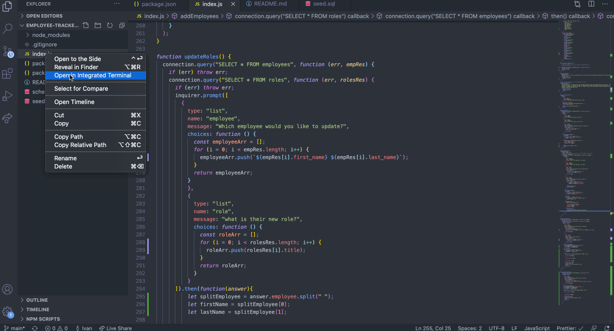

# Employee-Tracker-Ivan

## Table of Contents
* [Description](#Description)
* [Technologies](#Technologies)
* [Features](#Features)
* [Usage](#Usage)
* [Installation](#Installation)
* [Author](#Author)
* [Credits](#Credits)
* [License](#License)

## Description 
Hi! Welcome to my Employee Tracker App! Here You will find a way to keep track of your entire companies, employees, and managers for each department. In this app you are also able to add, delete, or update employess as well as wiew all the employees you currently have in your company. Navigate to the usage where I will provide instruction as to how to use this app. 


## Technologies
* [JavaScript](https://www.w3schools.com/js/)
* [Inquirer](https://www.npmjs.com/package/inquirer)
* [MySql](https://nodejs.dev/learn/the-nodejs-fs-module)
* [Node.js](https://nodejs.org/en/)


## Features


* Some of the coolest function I have in here will be presented but I wanted to show you this one because it took me a while to get it and it worked after some loss of hair. This Function add employees by nesting three connection.query's the first two are made so I can access items from the employee table and the roles table. The thrid connection is to be able to INSERT into employees. 
```
function addEmployees() {
  connection.query(
    "SELECT * FROM roles",
    // JOIN employees ON employees.role_id = roles.id GROUP BY roles.title",
    function (err, roleRes) {
      connection.query("SELECT * FROM employees", function (err, empRes) {
        inquirer
          .prompt([
            {
              type: "input",
              name: "firstName",
              message: "What is the employee's first Name?",
            },
            {
              type: "input",
              name: "lastName",
              message: "What is the employee's last name?",
            },
            {
              type: "list",
              name: "roles",
              message: "What role would you like to add them to?",
              choices: function () {
                var roleArr = [];
                for (i = 0; i < roleRes.length; i++) {
                  roleArr.push(roleRes[i].title);
                }
                return roleArr;
              },
            },
            {
              type: "list",
              name: "manager",
              message: "What manager do you want to add to?",
              choices: function () {
                const manager = [];
                for (i = 0; i < empRes.length; i++) {
                  if (empRes[i].manager_id === null) {
                    manager.push(empRes[i].first_name);
                  }
                }
                manager.push("None");
                return manager;
              },
            },
          ])
          .then(function (answer) {
            let newRole;
            for (i = 0; i < roleRes.length; i++) {
              if (roleRes[i].title === answer.roles) {
                newRole = roleRes[i].id;
              }
            }
            let manId;
            for (i = 0; i < empRes.length; i++) {
              if (empRes[i].first_name === answer.manager) {
                manId = empRes[i].id;
              }
            }
            connection.query(
              "INSERT INTO employees SET ?",
              {
                first_name: answer.firstName,
                last_name: answer.lastName,
                role_id: newRole,
                manager_id: manId,
              },
              function (err) {
                if (err) throw err;
                console.log("Successfully added an employee!");
              }
            );
          });
      });
    }
  );
}
  ```


* This function took me a while as well bacically after a ton of googling and thank God for my tutor and w3 schools I was able to join three table and LEFT JOIN to diplay the managers to the right of the tables. 

```
function viewEmployees() {
  connection.query(
    "SELECT employees.id, employees.first_name, employees.last_name, roles.title, departments.name, roles.salary, CONCAT(manager.first_name, ' ', manager.last_name) AS manager FROM departments INNER JOIN roles ON departments.id = roles.department_id INNER JOIN employees ON roles.id = employees.role_id LEFT JOIN employees manager ON employees.manager_id = manager.id ORDER BY employees.id ASC",
    function (err, res) {
      if (err) throw err;
      console.table(res);
    }
  );
}
```


## Usage
### MySql Workbench
So In order to Run this app you have to install everything that is in the installation section right below. After you are all set and done you will have to login to you MySql Work bench and createa a seed and schema file. Then you want to copy and past everything provided in the sql files in order to get started. 

### Node.js
Once you are all set you will want to type in your password in the index.js file but for now I have my password in there as a place holder. The You will open the integrated terminal and run 
```
node index.js
```

### The app
There you will be provided with a serious of inquirer prompts where you will have the option to either view all employees, add employees, update emplyees and much more. Have fun! 

## Installation
In order to run this app you have to install inquirer using 
```
mpi install inquirer
```
Then You intall MySql

```
npm install mysql
```

then to install console.tables in orders for your table to look pretty
```
npm install console.table
```
Now that you have everything installed you want to run 
```
node index.js
```

## Author
Ivan Torres
* [GitHub-Repo](https://github.com/IvanTorresMia/READme-project-Ivan)
* [linkedIn](www.linkedin.com/in/ivan-torres-0828931b2)

## Credits
* Credits for this homework assignment go out to Jerome, Manuel, Kerwin, Roger, and all of my classmates who helped me in study sessions. As well as my tutor who helped me a ton with understanding this homework assignment. 
* [StackOverFlow](https://stackoverflow.com/)


## License]
[MIT](https://choosealicense.com/licenses/mit/#) license 